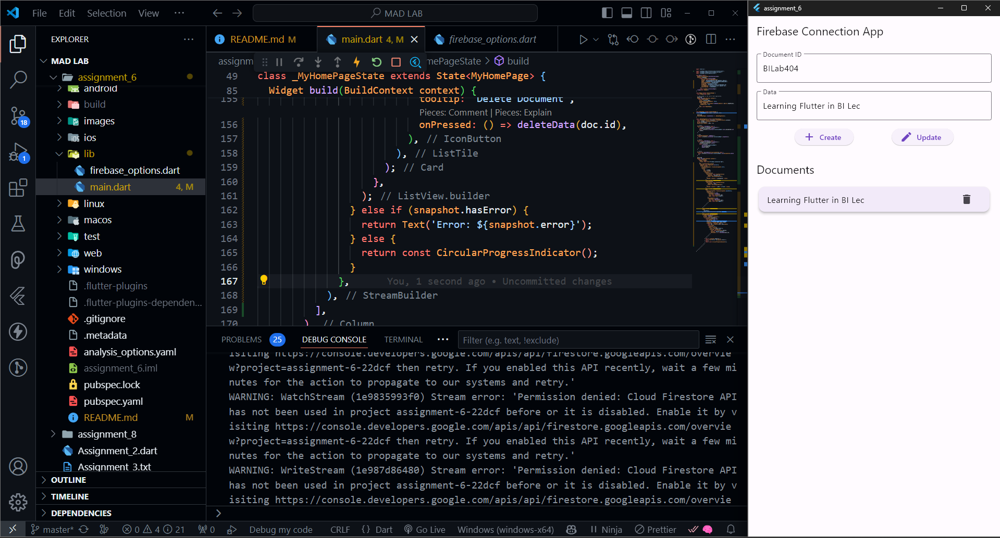
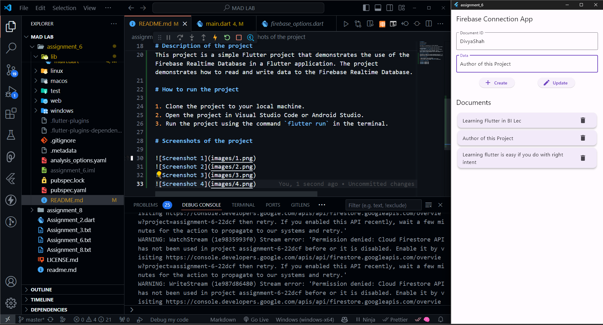
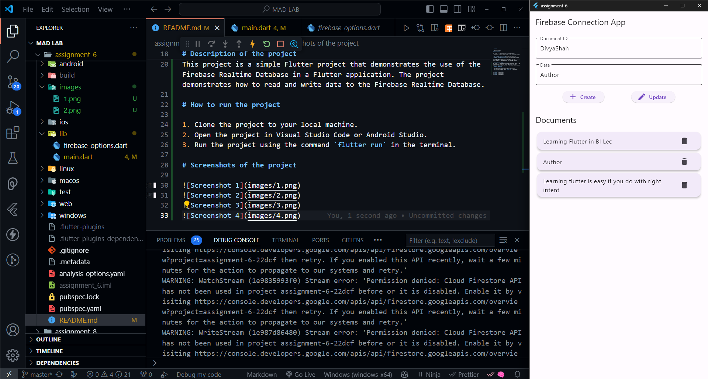
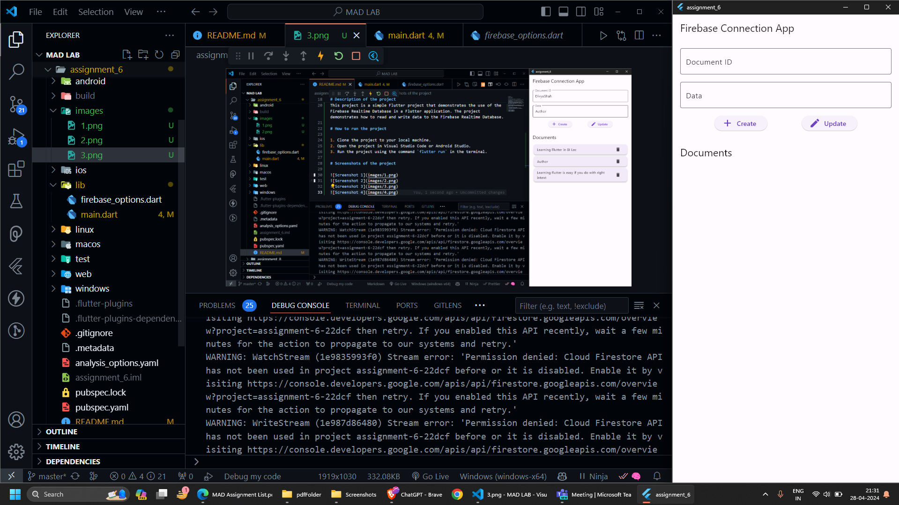

# assignment_6

A new Flutter project.

## Getting Started

This project is a starting point for a Flutter application.

A few resources to get you started if this is your first Flutter project:

- [Lab: Write your first Flutter app](https://docs.flutter.dev/get-started/codelab)
- [Cookbook: Useful Flutter samples](https://docs.flutter.dev/cookbook)

For help getting started with Flutter development, view the
[online documentation](https://docs.flutter.dev/), which offers tutorials,
samples, guidance on mobile development, and a full API reference.

# Description of the project

This project is a simple Flutter project that demonstrates the use of the Firebase Realtime Database in a Flutter application. The project demonstrates how to read and write data to the Firebase Realtime Database.

# How to run the project

1. Clone the project to your local machine.
2. Open the project in Visual Studio Code or Android Studio.
3. Run the project using the command `flutter run` in the terminal.

# Screenshots of the project






# Disclaimer

You need to change the Firebase configuration in the project to your own Firebase configuration in order to run the project successfully.

For now you can copy all things from the file present in lib/ folder 📁
name of the file is :card_file_box: ```firebase_options.dart```